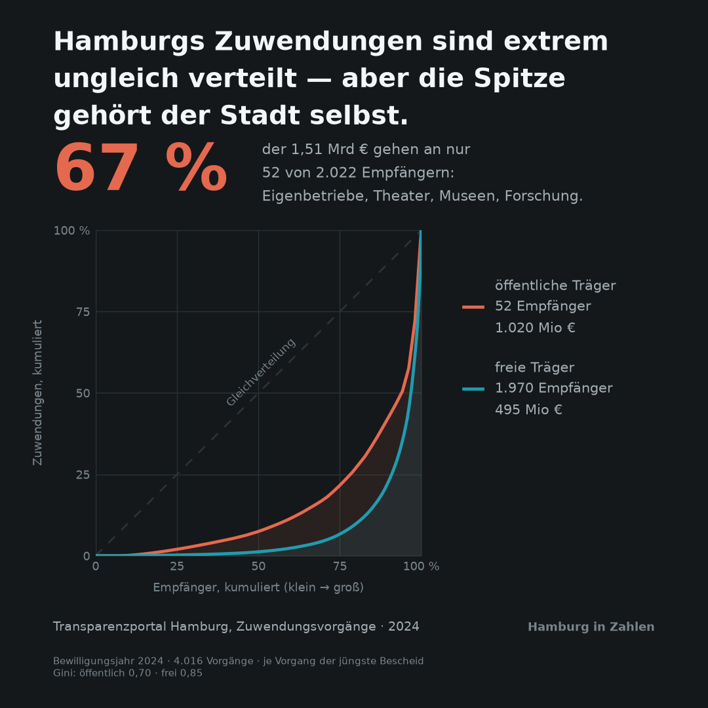

# Hamburg in Zahlen 🚀

> Offene Daten der Stadt Hamburg werden zu einer Serie von Instagram-Kacheln. Jede Kachel zeigt einen Befund, keine Zahl.

## 📊 Projektübersicht

**Problemstellung:**
Hamburg veröffentlicht große Mengen offener Daten — Zuwendungen, Wohnungsbau, Baumkataster, Sozialmonitoring. Sie liegen als CSV, PDF-Tabellen und Geodienste vor und werden kaum gelesen. Rohe Zahlen erklären nichts: „Hamburg vergab X Mio €" ist keine Aussage.

**Ziel:**
Eine Pipeline von der offenen Datenquelle bis zur fertigen Grafik (1080×1080 PNG, einheitliches Layout, als Serie erkennbar). Jede Kachel beantwortet eine Frage mit einem Befund — z. B. „3 % der Empfänger bekommen die Hälfte der Summe" statt einer Gesamtsumme. In vier Sekunden verständlich, die Analysearbeit bleibt sichtbar.

**Methoden:**
Datenbeschaffung über Transparenzportal-CSV, PDF-Tabellenextraktion aus Bürgerschafts-Drucksachen und Geodienste (WFS). Aufbereitung mit pandas, Konzentrationsanalyse (Lorenzkurve, kumulierte Anteile), räumlicher Join und Korrelationsanalyse, Normalisierung pro Kopf bzw. pro Fläche. Visualisierung mit matplotlib über eine gemeinsame Renderfunktion.

### Die vier Kacheln

| # | Thema | Frage | Quelle |
|---|-------|-------|--------|
| 01 | Sozialwohnungen | Hamburg baut — warum schrumpft der Bestand trotzdem? | Bürgerschafts-Drucksachen (PDF) |
| 02 | Zuwendungen | Welcher Anteil der Empfänger bekommt die Hälfte des Geldes? | Transparenzportal Hamburg (CSV) |
| 03 | Straßenbäume | Fällungen vs. Nachpflanzungen je Stadtteil | Straßenbaumkataster (WFS) |
| 04 | Bäume × soziale Lage | Hängt der Baumbestand mit der sozialen Lage zusammen? | Baumkataster × Sozialmonitoring |

### Kachel 02 — Konzentration der Zuwendungen



Hamburg hat 2024 rund **1,51 Mrd €** an Zuwendungen bewilligt — 4.016 Vorgänge,
2.022 Empfänger. Die Verteilung ist extrem schief, aber nicht so, wie die
naheliegende Schlagzeile es hätte: **67 % gehen an 52 öffentliche Träger** —
städtische Eigenbetriebe, Staatstheater, Landesmuseen, Forschungsorganisationen.
Die 1.970 freien Träger teilen sich die übrigen 495 Mio €, und untereinander
sind sie *ungleicher* verteilt als die öffentliche Seite (Gini 0,85 gegen 0,70).

Drei Eigenheiten der Quelle waren dafür zu klären — jede einzelne hätte das
Ergebnis um ein Vielfaches verfälscht. Nachgewiesen in
[notebooks/02_zuwendungen.ipynb](notebooks/02_zuwendungen.ipynb):

1. Die vier Quartalsdateien sind **kumulative Auszüge** über rund zehn Jahre,
   keine Quartalszuwächse. Verkettet man sie, zählt man fast alles vierfach.
2. `Zuwendungssumme` nennt auf **jedem** Bescheid den aktuellen Gesamtbetrag des
   Vorgangs, nicht eine Veränderung. Ein Vorgang hat bis zu 23 Bescheide.
   Deshalb: je `INEZ-Nummer` der jüngste Bescheid.
3. Die Spitze der Rangliste besteht nicht aus Vereinen. Ohne die Trennung nach
   Trägerschaft ([src/core/traeger.py](src/core/traeger.py)) entstünde ein
   falscher Eindruck.

## Setup

Klone das Repository
```bash
git clone https://github.com/Coco1606/hamburg-in-zahlen.git
cd hamburg-in-zahlen
```

Installiere [uv](https://uv.dev) (falls noch nicht installiert) und synchronisiere die Abhängigkeiten
```bash
uv sync
```

### Ausführung

1. [notebooks/02_zuwendungen.ipynb](notebooks/02_zuwendungen.ipynb) — Kachel 02: Konzentration der Zuwendungen

Rohdaten liegen in `data/raw/` und sind nicht versioniert; `core.fetch` lädt sie
beim ersten Lauf aus dem Transparenzportal und cached sie danach.

### Module

| Datei | Aufgabe |
|---|---|
| [src/core/fetch.py](src/core/fetch.py) | Rohdaten holen und cachen |
| [src/core/analyse.py](src/core/analyse.py) | je Thema eine Funktion → ein `Befund` |
| [src/core/traeger.py](src/core/traeger.py) | Empfänger nach Trägerschaft einordnen |
| [src/core/render.py](src/core/render.py) | `render_tile(befund)` → 1080×1080 PNG |

`Befund` ist die einzige Schnittstelle zwischen Analyse und Gestaltung:
`render.py` kennt keine Zuwendungen, `analyse.py` kein matplotlib. Deshalb lässt
sich das Layout ändern, ohne die Analyse anzufassen — und umgekehrt.

## Methodische Hinweise

- **Normalisieren:** Absolute Werte je Stadtteil bilden sonst nur die Einwohnerzahl ab.
- **Bezugsjahr:** Die Datensätze haben unterschiedliche Stände; das Jahr steht auf jeder Kachel.
- **Zuwendungen:** Durchleitungsstellen prüfen, bevor „X bekommt am meisten" behauptet wird.
- **Kachel 04:** Zusammenhang formulieren, nie Ursache; Drittvariablen (z. B. Bebauungsdichte) benennen.

## Datenquellen

- [Transparenzportal Hamburg](https://transparenz.hamburg.de/)
- [Hamburger Bürgerschaft — Parlamentsdatenbank](https://www.buergerschaft-hh.de/parldok/)
- [Geoportal Hamburg / Geodienste](https://geoportal-hamburg.de/)
